# Uber Clone - Ride Sharing Application

A full-stack ride-sharing platform built with Node.js, Express, React, and Socket.IO for real-time updates. This project implements a complete Uber-like experience with user and captain (driver) functionalities.

## About

This is a comprehensive ride-sharing application that connects users and drivers in real-time. The platform features:

- **User Module**: Book rides, select vehicle types, track drivers live, and make payments
- **Captain Module**: Accept/reject ride requests, start/finish rides, and earn money
- **Real-time Updates**: Socket.IO integration for live driver tracking and instant notifications
- **Authentication**: JWT-based secure authentication for users and captains
- **Maps Integration**: Google Maps API for location services and route optimization
- **Payment System**: Integration-ready payment gateway

---

## 📸 UI Screenshots

### User Features

**User Login** | **User Signup** | **User Home**
<br>
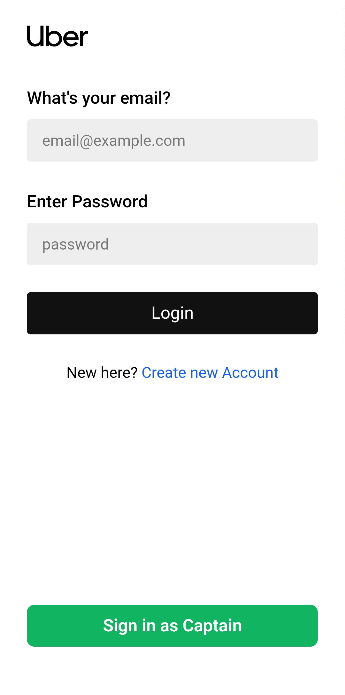 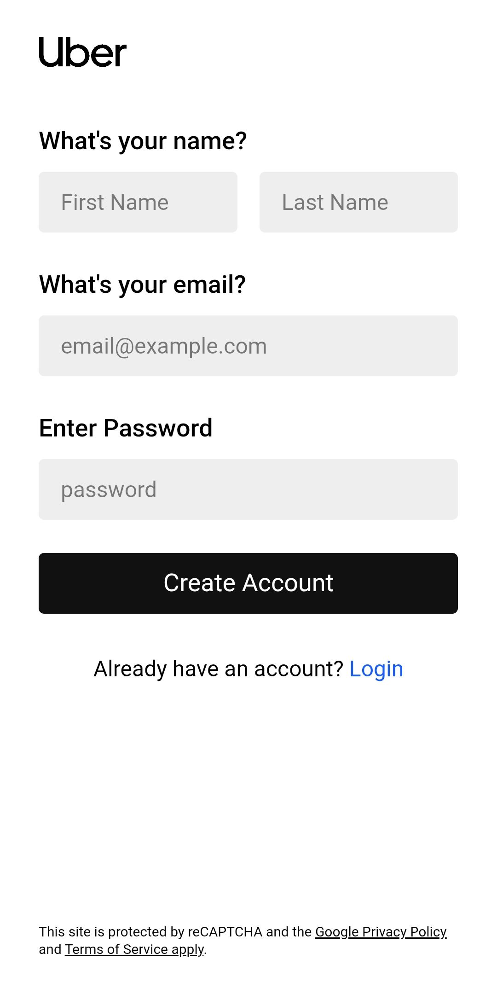 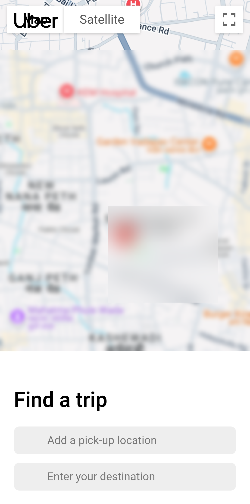

**Search Location** | **Select Vehicle** | **Confirm Ride**
<br>
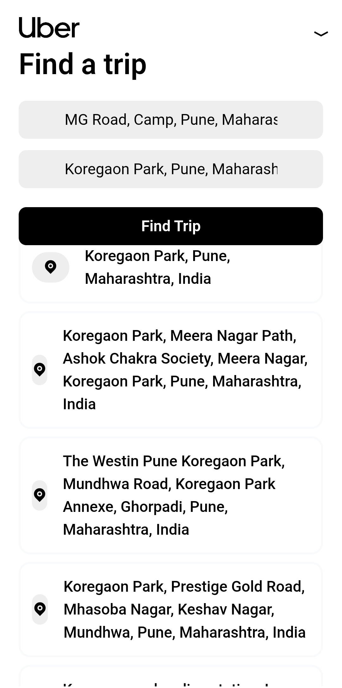 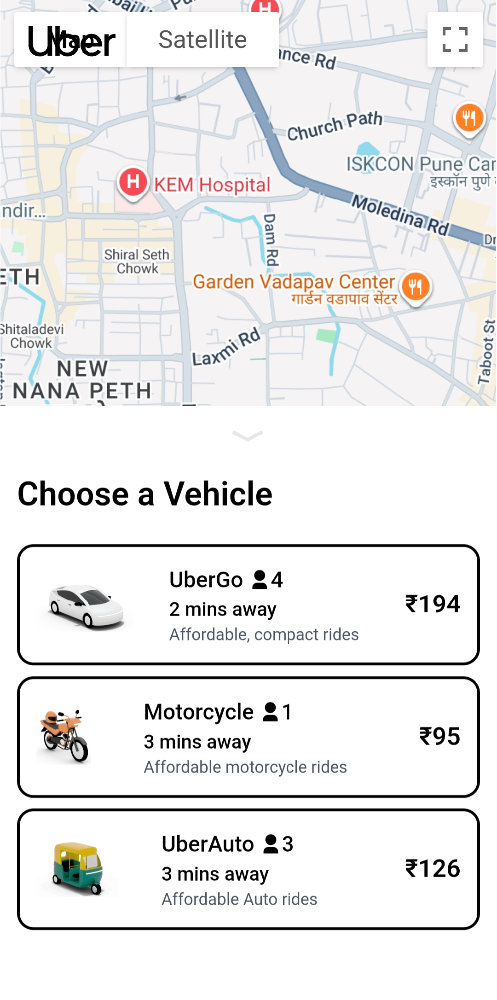 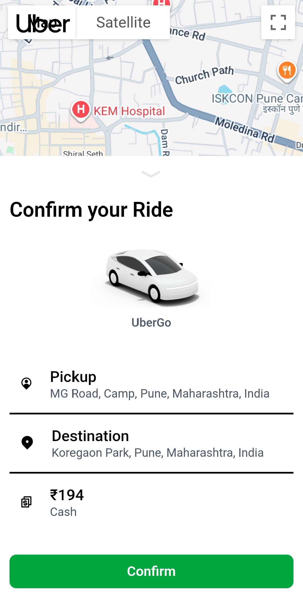

**Waiting for Driver** | **Live Tracking** | **Looking for Driver**
<br>
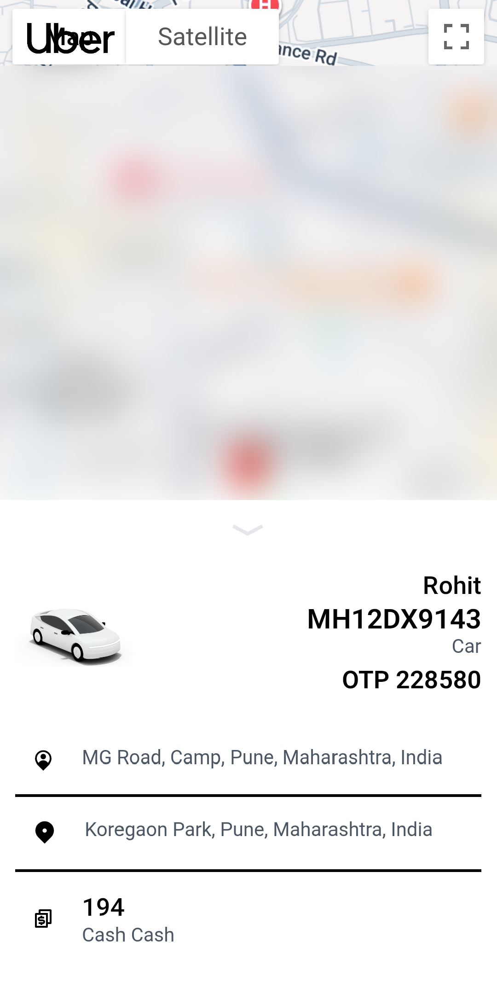 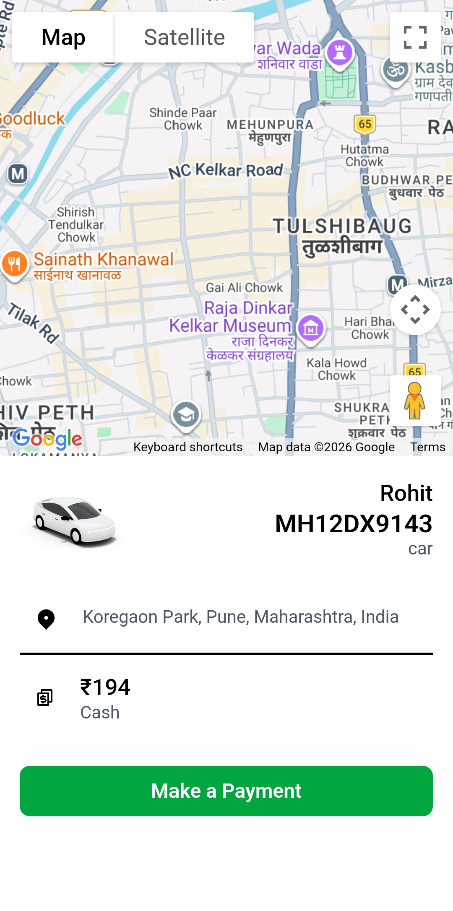 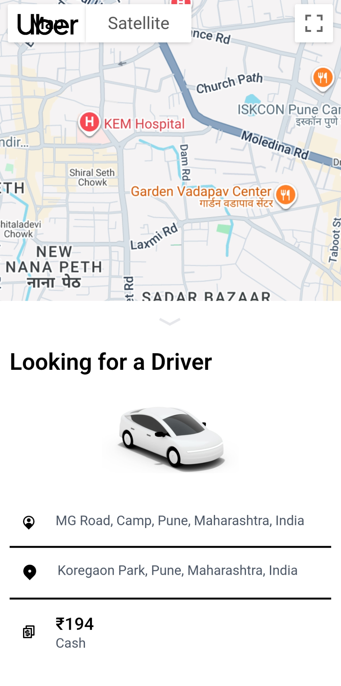

---

### Captain (Driver) Features

**Captain Login** | **Captain Signup** | **Captain Home**
<br>
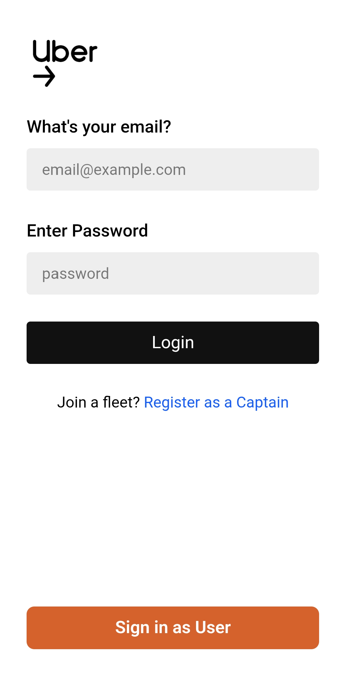 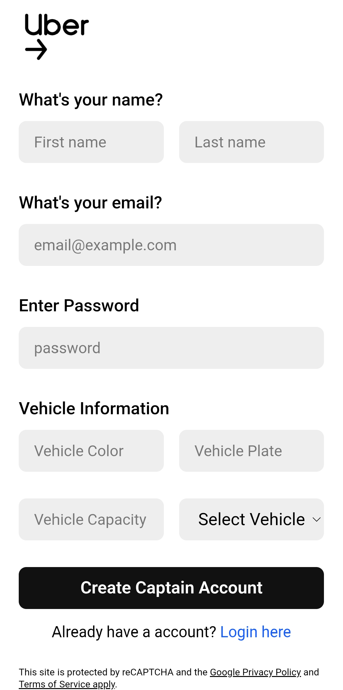 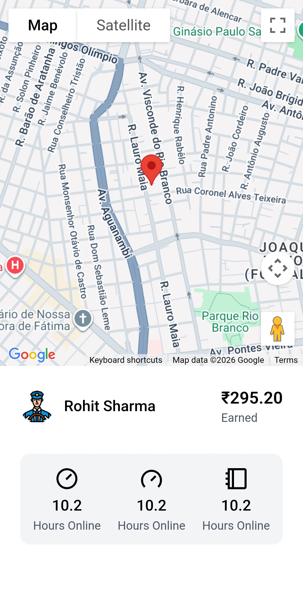

**Ride Popup** | **Start Ride** | **Ride in Progress**
<br>
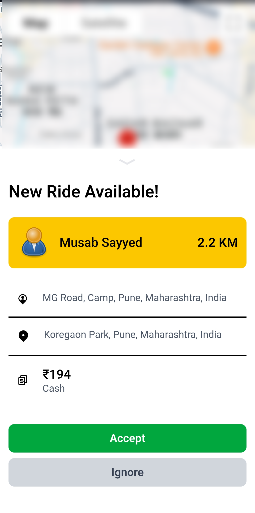 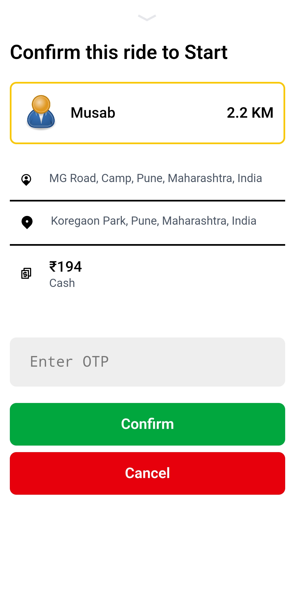 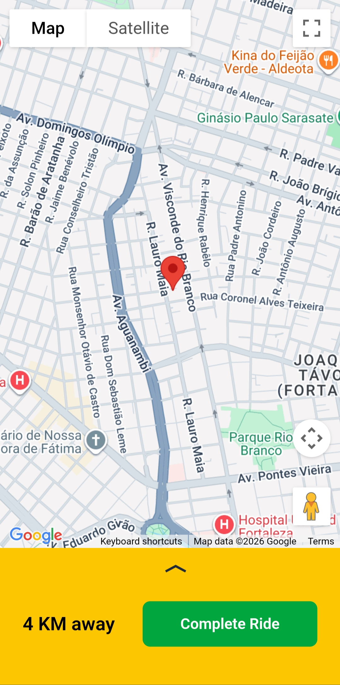

**Finish Ride**
<br>
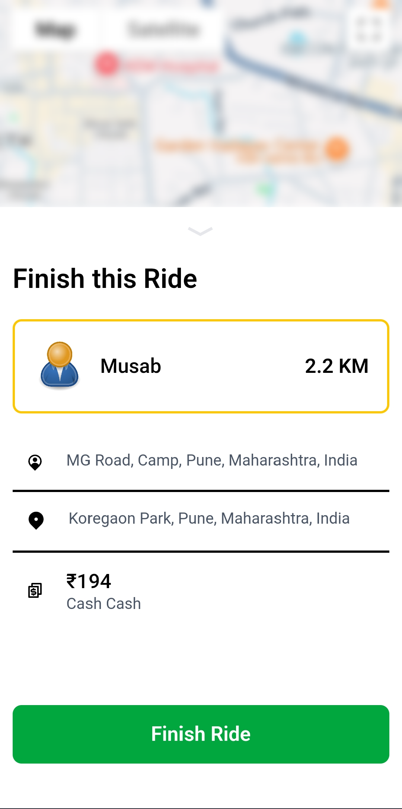

---

## 🏗 Project Structure

```
uber/
├── client/                    # React + Vite frontend
│   ├── src/
│   │   ├── pages/            # Route-level pages
│   │   ├── components/       # Reusable UI components
│   │   ├── context/          # Global state (User, Captain, Socket)
│   │   └── assets/           # Images and static files
│   ├── package.json
│   └── README.md             # See for detailed client setup
│
├── server/                    # Node.js + Express backend
│   ├── controllers/          # Route handlers
│   ├── services/             # Business logic
│   ├── models/               # MongoDB schemas
│   ├── routes/               # API endpoints
│   ├── middlewares/          # Custom middleware
│   ├── config/               # Database configuration
│   ├── socket.js             # Socket.IO setup
│   ├── app.js                # Express app
│   ├── package.json
│   └── README.md             # See for detailed server API docs
│
└── screenshots/              # UI mockups and screenshots
```

---

## ⚡ Quick Start

### Prerequisites

- Node.js
- MongoDB
- Google Maps API Key

### Setup Instructions

**1. Client Setup** (See [client/README.md](client/README.md) for detailed instructions)

```bash
cd client
npm install
echo VITE_BASE_URL=http://localhost:3000 > .env
npm run dev
```

**2. Server Setup** (See [server/README.md](server/README.md) for detailed instructions)

```bash
cd server
npm install
npm start
```

The frontend will be available at `http://localhost:5173` and backend at `http://localhost:3000`

---

## 📖 Detailed Documentation

For comprehensive information about setup, configuration, and API endpoints:

- **[Client Documentation](client/README.md)** - React frontend, components, routes, environment setup
- **[Server Documentation](server/README.md)** - API endpoints, authentication flow, database models

---

## 🎯 Key Features

### User Features

- ✅ User Registration & Login
- ✅ Real-time Location Tracking
- ✅ Multiple Vehicle Options (UberGo, Motorcycle, UberAuto)
- ✅ Live Driver Tracking
- ✅ Ride History
- ✅ Secure Logout

### Captain Features

- ✅ Captain Registration & Login
- ✅ Vehicle Information Management
- ✅ Real-time Ride Requests
- ✅ Accept/Reject Rides
- ✅ Live Location Sharing
- ✅ Earnings Dashboard

### Technical Features

- ✅ Real-time Updates via Socket.IO
- ✅ JWT Authentication
- ✅ MongoDB Database
- ✅ Google Maps Integration
- ✅ Responsive UI with Tailwind CSS
- ✅ Protected Routes

---

## 🔑 Environment Variables

See the individual README files for environment configuration:

- **Client**: [client/README.md#environment-variables](client/README.md#environment-variables)
- **Server**: [server/README.md](server/README.md)

---

## 📱 Technology Stack

**Frontend:**

- React 18 + Vite
- Tailwind CSS
- Axios
- Socket.IO Client
- React Router

**Backend:**

- Node.js + Express
- MongoDB + Mongoose
- Socket.IO
- JWT Authentication
- Google Maps API

---

## 🚀 API Routes Overview

All API endpoints are documented in [server/README.md](server/README.md). Key routes include:

- `POST /api/users/register` - User registration
- `POST /api/users/login` - User login
- `GET /api/users/profile` - Get user profile
- `POST /api/captains/register` - Captain registration
- `POST /api/rides` - Create a ride request
- And more...

---

## 🔗 Socket.IO Events

Real-time events handled through Socket.IO:

- `new-ride` - Notify captains of new ride requests
- `ride-confirmed` - Notify user when ride is accepted
- `ride-started` - Notify user when ride begins
- `ride-ended` - Notify user when ride completes
- And more...

---

## 📝 License

This project is open source and available for educational purposes.

---

## 🤝 Support

For questions or issues:

1. Check the [Client README](client/README.md)
2. Check the [Server README](server/README.md)
3. Review the screenshots for UI reference

---

**Happy Coding! 🚗**
